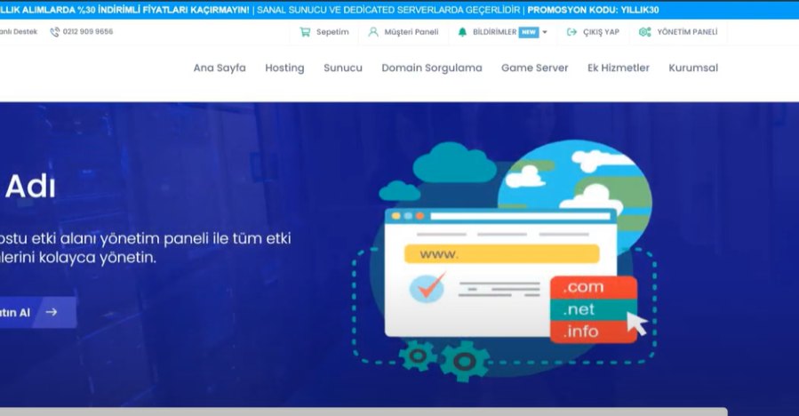

## PreHost WHMC Teması

**PreHost WHMC Teması**, WHMCS için özel olarak geliştirilmiş, modern ve kullanıcı dostu bir temadır. Tema, tamamen Türkçe dil desteği ile hazırlanmış olup, web hosting yönetim süreçlerinizi daha profesyonel bir hale getirmeyi hedeflemektedir.
Daha fazlasını görmek için internet sitemi ( https://marthex.dev/ ) ziyaret etmeyi unutma.

---

## Özellikler

- **Tam Türkçe Desteği:**  
  Tüm kullanıcı arayüzü öğeleri ve metinler Türkçe olarak hazırlanmıştır. Böylece, Türkçe konuşan kullanıcılar için kullanım kolaylığı sağlar.

- **Kolay Kurulum:**  
  WHMCS klasörünüzün içerisine yükleyerek temayı hızlıca çalıştırabilirsiniz. Kurulum süreci oldukça basittir ve ekstra yapılandırma gerektirmez.

- **Modern Tasarım:**  
  Estetik ve güncel tasarım öğeleri ile donatılmış olan tema, web sitenizin profesyonel görünmesini sağlar.

- **Uyumlu Yapı:**  
  WHMCS ile sorunsuz entegre olacak şekilde optimize edilmiştir. Mevcut WHMCS yapılandırmanızla kolayca uyum sağlar.

- **Hızlı Performans:**  
  Minimal ve optimize edilmiş kod yapısı sayesinde, sayfa yüklenme sürelerini kısaltır ve performansı artırır.

---

## Kurulum Adımları

1. **Tema Dosyalarını İndirin:**
   - GitHub veya temanın sunulduğu diğer kaynaklardan en güncel dosyaları indirin.

2. **Dosyaların Yüklenmesi:**
   - İndirdiğiniz dosyaları, WHMCS kurulumunuzun ana klasörü içinde bulunan `templates` veya `themes` dizinine kopyalayın.
   - Eğer mevcut temanız varsa, üzerine yazmadan önce yedek almanız önerilir. Alternatif olarak, yeni bir klasör oluşturarak temayı bu klasöre yerleştirebilirsiniz.

3. **Tema Ayarlarının Yapılandırılması:**
   - WHMCS yönetici panelinize giriş yapın.
   - **Ayarlar > Genel Ayarlar > Template (Tema)** bölümüne gidin ve yeni yüklediğiniz temayı seçin.
   - Gerekli diğer yapılandırma ayarlarını, sisteminize uygun şekilde düzenleyin.

4. **Test ve Canlıya Alma:**
   - Kurulum tamamlandıktan sonra, web sitenizin ön yüzünü test edin. Tüm linklerin, görsellerin ve diğer bileşenlerin doğru çalıştığından emin olun.
   - Eğer isterseniz, HTML, CSS ve JavaScript dosyalarını düzenleyerek temayı markanıza göre özelleştirebilirsiniz.

---

## Özelleştirme

- **HTML & CSS Düzenlemeleri:**  
  Temanın görünümünü ve stilini değiştirmek için dosyalar içindeki HTML ve CSS kodlarını istediğiniz gibi düzenleyebilirsiniz.

- **Dil ve Metin Güncellemeleri:**  
  Tüm metinler Türkçe olarak hazırlanmıştır. Ancak, gerektiğinde metinlerde değişiklik yaparak temayı daha da kişiselleştirebilirsiniz.

- **Ek Fonksiyonlar:**  
  Tema üzerinde ek özellikler veya modüller eklemek isterseniz, WHMCS’nin modül yapısını kullanarak genişletme yapabilirsiniz.

---

## Destek ve Geri Bildirim

Tema ile ilgili sorun yaşamanız veya geliştirme önerileriniz olması durumunda, GitHub üzerindeki [Issue](https://github.com/kullaniciadi/proje-adi/issues) bölümünden bize ulaşabilirsiniz. Aldığımız geri bildirimler, temayı daha iyi hale getirmemiz için büyük önem taşımaktadır.

---

PreHost WHMC Teması ile web hosting yönetim süreçlerinizi kolaylaştırın ve müşteri deneyimini üst düzeye çıkarın. İyi kullanımlar!

## Görüntü 

